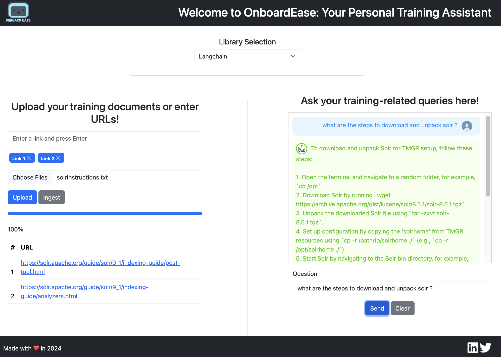
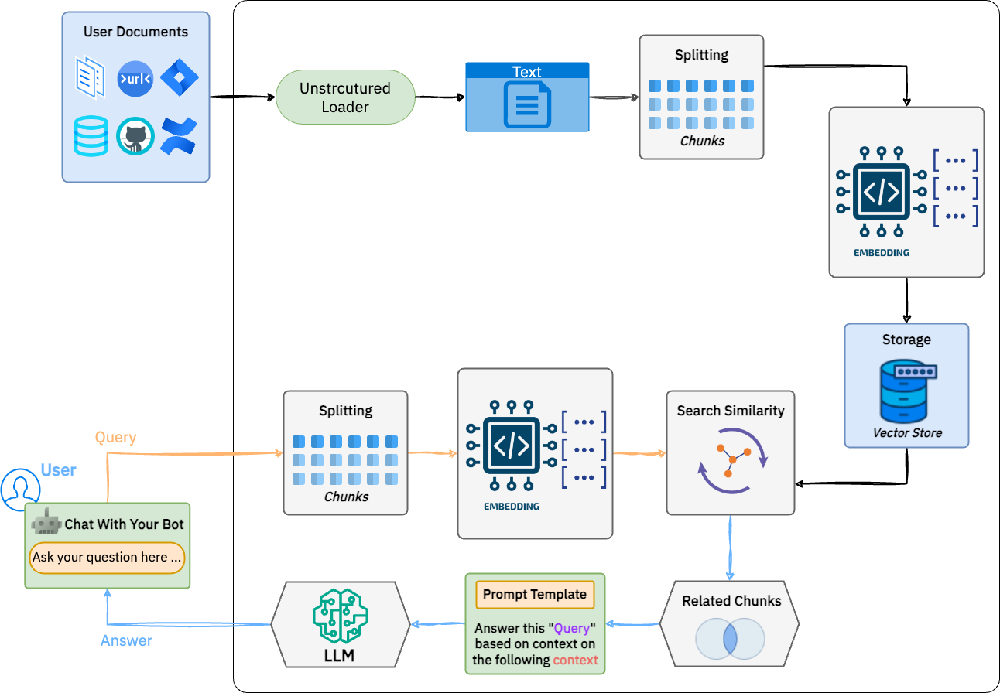

### OnboardEase - Dynamic Learning Assistant with Langchain4j & Spring AI 🦜️🔗 + 🍃🤖️

<p align="center">
  
</p>

> OnboardEase: A dynamic learning assistant designed to simplify the onboarding and training process for new hires.
Users can upload documents or enter URLs for training materials, and the application provides a platform for asking training-related queries.
Built with Spring Boot, Langchain4j and Spring AI.

💡 This application is not business oriented and my focus is mostly on technical part, I just want to play with LLM/RAG chatbot assistant by building a sample app from scratch with two main libraries in java ecosystem : [Spring AI 🍃](https://github.com/spring-projects/spring-ai) and [Langchain4j 🦜️](https://github.com/langchain4j/langchain4j).

🌀 This Application is `in-progress` and I will add new features over time. 🌀

## Application Screenshot



## Features

- ✅ Choose between two libraries for chatbot assistant : `Langchain4j` or `Spring AI`
- ✅️ Upload documents or enter URLs for training materials
- ✅️ Ingest documents and give context to the chatbot
- ✅️ Ask training-related queries

## Tech Stack

- **[`🍃️ Spring Boot`](https://spring.io/projects/spring-boot)** 
- **[`🦜️ Langchain4j`](https://docs.langchain4j.dev/)**
- **[`🤖️ Spring AI`](https://spring.io/projects/spring-ai)**
- **[`📦️ Maven`](https://maven.apache.org/)**
- **[`🐳️ Docker`](https://www.docker.com/)**
- **[`🐘️ PostgreDB`](https://www.postgresql.org/)**
- **[`🌐️ Thymeleaf`](https://www.thymeleaf.org/)**
- **[`🔍 PgVector (Postgres extension for similarity search)`](https://github.com/pgvector/pgvector)**
- **[`🧠 Openai`](https://beta.openai.com/docs/)**

## Setup & Installation

- 1️⃣ Clone the project on your local machine 
  > `git clone https://github.com/miliariadnane/onboardease-rag-training-assistant.git`
- 2️⃣ Install dependencies 
  > `mvn clean install`
- 3️⃣ Run docker-compose file : 
  > `docker-compose up -d`
- 4️⃣ Open PgAdmin UI and create two databases : `vector_store` and `langchain_vector_store`
  - 4️⃣- 1️⃣ For `vector_store` database, create an extension (do this once in each database where you want to use it) :
    ```sql
    CREATE EXTENSION vector;
    ```
- 5️⃣ Configure your openai API key in `application.properties` file or in your environment variables
- 6️⃣ Run the application
  > `mvn spring-boot:run`
- 🚀️ Open your browser and navigate to `http://localhost:8080` (Enjoy the app 🎉️)

## How RAG Works under the hood ?



- 1️⃣ Ingest domain data and give context to the chatbot.
- 2️⃣ Reader to retrieve text from the documents.
- 3️⃣ Splitter to split the text into chunks.
- 4️⃣ Embedding to convert the text into vectors.
- 5️⃣ Store the vectors in the vector store database.
- 6️⃣ User ask the question to the chatbot.
- 7️⃣ Splitter to split the question into chunks.
- 8️⃣ Embedding to convert the question into vectors.
- 9️⃣ Similarity search to find the most relevant chunks between the question and the documents ingested.
- 🔁️ Loop through the chunks and return the most relevant answer to the user.
- 🎉️ Return the answer to the user.

## Roadmap (In Progress)

- [x] 🚧 Fix AI text embedding issue (Spring AI) 
- [ ] 🚧 Implement similarity search to find the most relevant answer to the user (Spring AI)
- [ ] 🚧 Add system message prompt (Spring AI)
